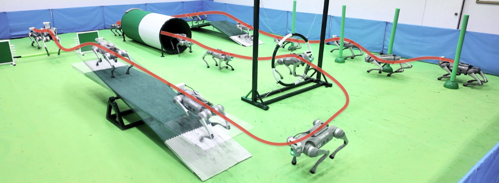

# Learning Diverse Natural Behaviors for Enhancing the Agility of Quadrupedal Robots #

<div align="center">

[[Website]](https://nju-rlc.github.io/quadrupedal_agility/)
[[Paper]]()
[[Video]](https://youtu.be/dUdg_KvlaLs)

</div>

<p align="center">

</p>

## Installation ##
- Create a new python virtual environment with `python 3.8`
```bash
conda create -n agility python=3.8
conda activate agility
```
- Install `pytorch 2.3.1` with `cuda-11.8`
```bash
pip install torch==2.3.1+cu118 torchvision==0.18.1+cu118 torchaudio==2.3.1+cu118 -f https://download.pytorch.org/whl/cu118/torch_stable.html
```
- Install `Isaac Gym`
  - Download and install [Isaac Gym Preview 4](https://developer.nvidia.com/isaac-gym)
  ```bash
    cd isaacgym/python
    pip install -e .
  ```
  - Try running an example
  ```bash
    cd examples
    python 1080_balls_of_solitude.py
  ```
  - For troubleshooting, check docs in `isaacgym/docs/install.html`
- Clone this repository and install the additional dependencies
```bash
git clone https://github.com/NJU-RLC/quadrupedal-agility.git
cd quadrupedal-agility
pip install -r requirements.txt
```

## Usage ##
### Train BBC ###
Go to `bbc/legged_gym/scripts` and run
```bash
python train.py --task go2_locomotion --experiment_idx 0 --device_id 0 --headless True
```
- Train ~200k iterations (~4 days on 3090). The trained policy is saved in `bbc/logs/go2_locomotion/0/model.pt`.
- Five behavioral modes are considered: walk, pace, trot, canter, and jump. To incorporate custom behavior modes, you'll need to extract the relevant segments from the motion capture data. For more details, please refer to our previous work [MetalHead](https://github.com/inspirai/MetalHead).

### Train TSC ###
Before training, please copy the trained BBC model `model.pt` to `tsc/weights/bbc` (A pre-trained model has been provided). Then go to `tsc/legged_gym/scripts` and run
```bash
# Train TSC-teacher
python train.py --proj_name agility --exptid base --device_id 0 --randomize_start --randomize_base_mass --randomize_base_com --push_robots
# Train TSC-student
python train.py --proj_name agility --exptid dist --device_id 0 --resume --resumeid base --use_camera
```
- Train ~30k iterations (~20 hours on 3090) for TSC-teacher, and ~15k iterations (~17 hours on 3090) for TSC-student. The trained policies are saved in `tsc/logs/agility/base/model.pt` and `tsc/logs/agility/dist/model.pt`.

### Train EASI ###
We have used the optimized simulator parameter settings in BBC training. For more information on EASI training, please refer to our previous work [EASI](https://github.com/BlackVegetab1e/EASI).

### Play BBC ###
Go to `bbc/legged_gym/scripts` and run
```bash
python play.py --task go2_locomotion --load_run 0
```
- Continuously press `W/S` for acceleration and deceleration, control steering with `A/D`, and switch behavior modes between `1-5`.

### Play TSC ###
Go to `tsc/legged_gym/scripts` and run
```bash
# Play TSC-teacher
python play.py --proj_name agility --exptid base
# Play TSC-student
python play.py --proj_name agility --exptid dist --use_camera
```
- Switch to next/prev robot with `[ ]`, switch between free camera and following camera with `F`.

## Citation ##
If you found any part of this code useful, please consider citing:
```
@article{fu2025learning,
title={Learning Diverse Natural Behaviors for Enhancing the Agility of Quadrupedal Robots},
author={Fu, Huiqiao and Dong, Haoyu and Xu, Wentao and Zhou, Zhehao and Deng, Guizhou and Tang, Kaiqiang and Dong, Daoyi and Chen, Chunlin},
journal={ArXiv},
year={2025}
}
```
## References ##
The code is built upon the open-sourced [IsaacGymEnvs](https://github.com/NVIDIA-Omniverse/IsaacGymEnvs), [rsl_rl](https://github.com/leggedrobotics/rsl_rl), [legged_gym](https://github.com/leggedrobotics/legged_gym), [MetalHead](https://github.com/inspirai/MetalHead), and [extreme-parkour](https://github.com/chengxuxin/extreme-parkour).
